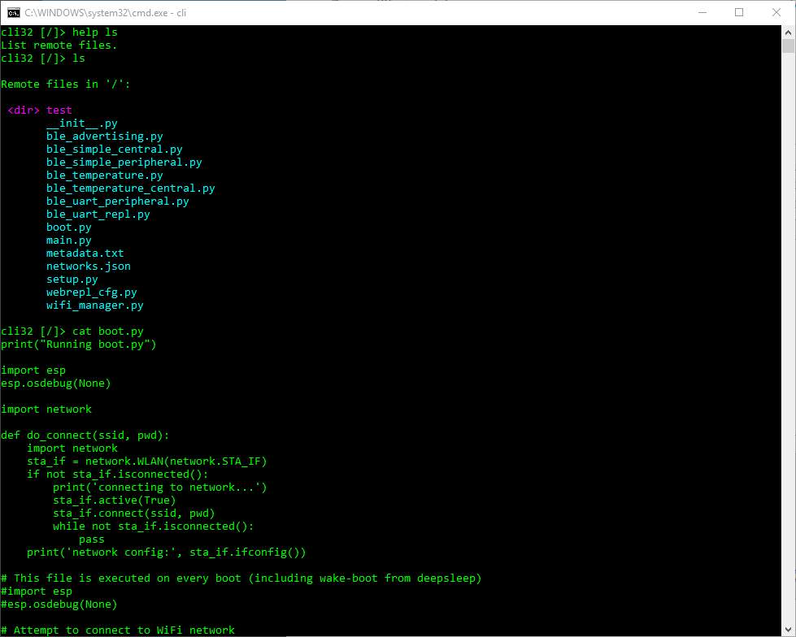

esp32 CLI module
================

The ESP32cli module is heavily based on MPFShell.

It is also used in the ESP32gui module.

Screenshot of the CLI:

.. automodule:: esp32cli
   :members:
   :undoc-members:
   :show-inheritance:

